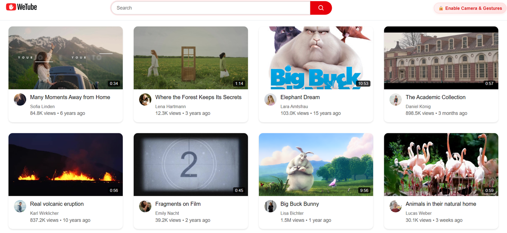
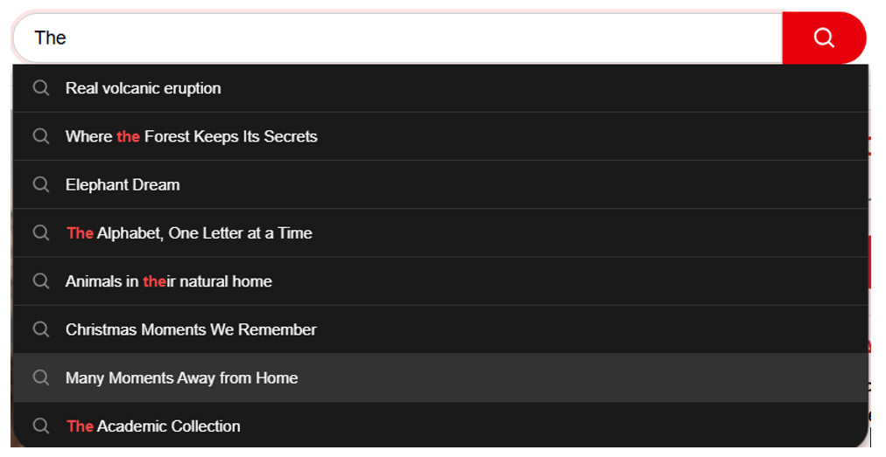

## Overview
WeTube is a gesture-controlled video application that allows interaction with a YouTube-like interface from a distance.
Users can control core video functions such as playback, navigation and volume using only hand gestures and a standard webcam.
The result is a functional prototype that demonstrates the feasibility of gesture-based control in a web browser that serves as an alternative to traditional input devices.

## Objectives
- To investigate whether gesture-based interaction can reduce reliance on traditional input devices.
- To evaluate whether gesture control can improve everyday scenarios (e.g., teaching, cooking).
- To design gestures that are both robust and intuitive for users.
- To provide continuous visual feedback to improve user understanding of the system state.

Constraints:
- Variability of lighting conditions and backgrounds during testing.
- Browser-based execution only (no native applications allowed).
- Limited to hand gestures that can be recognized by a webcam.
- System behavior varies across different hardware devices.

## Approach & Architecture
- The interaction concept is based on existing video platforms and is extended with gesture-based control.
- Hand movements are captured via webcam and processed in real time.
- Recognized gestures are mapped to actions such as play, pause, skip and navigation.

Components:
- Camera Input: Captures live video feed of the user.
- Gesture recognition: hands and landmarks are detected and interpreted.
- Control mapping: gestures are translated into semantic actions.
- UI interface: a simplified YouTube-like frontend reacts to commands (HomePage, Search Functionality & Video Player).

Key Algorithms / Models:
- MediaPipe Hands is used for real-time hand tracking and landmark detection.
- Custom gesture recognition logic is implemented based on landmark positions and movements.
- Rule-based gesture classification is applied on top of detected landmarks.
- Modular separation between recognition logic and UI logic is used.
- Two interaction modes (Gesture Mode and Cursor Mode) are implemented to improve usability.

Design Decisions:
- A limited but reliable gesture set was preferred over many complex gestures.
- Two modes (Gesture Mode and Cursor Mode) were introduced to reduce accidental activation.
- One-second gesture holding time was added to prevent unintended triggers.
- A custom video player was implemented to ensure compatibility with the virtual cursor.
- A Gesture Feedback Badge was implemented to provide immediate visual feedback when a gesture is recognized. This feedback reduced uncertainty and improved transparency of system behavior.

## Implementation
Languages, frameworks and tools:
- JavaScript, HTML and CSS were used for the frontend.
- A small backend component was implemented in Java using Spring Boot.
- Google MediaPipe Hands with HandLandmarker was used for real-time hand tracking.
- MediaPipe enables hand detection directly in the browser without special hardware.
- Some gestures rely on MediaPipe’s predefined recognition, while additional gestures were defined based on detected hand landmarks.
- No automated testing was used due to project scope and time constraints.

Core features implemented:
- Play/Pause: Victory
- Forward/backward seeking: Swipe right/left with four fingers
- Previous/next video: IlY right/ILY left
- Volume control: Thumb up/down
- Fullscreen mode: Open Palm
- Restart video: Pinch
- Activate Cursor Mode: Pointing Up with index finger
- Deactivate Cursor Mode: Fist
- Cursor control via hand movement

Data sources and preprocessing:
- Webcam video stream was used as the primary input source.
- Hand landmarks extracted by MediaPipe were used as the basis for gesture recognition.
- A cloud database (Neon, PostgreSQL) was used to store pre-saved videos for testing.
- No external datasets were used.

Deployment and runtime environment:
- The system was designed for local execution only.
- The application runs in a standard web browser.
- A standard laptop or desktop with a webcam is sufficient.
- No specialized hardware or cloud services are required.

## Results & Evaluation
Evaluation criteria were gesture recognition, responsiveness, system latency and usability.

What worked well:
- Gesture recognition accuracy was satisfactory in controlled lighting conditions.
- Gestures lead to successful execution of video control commands.
- System latency was low enough for real-time interaction.
- Users were able to learn most gestures quickly.
- Accuracy decreased for more complex gestures.

Limitations:
- Recognition accuracy decreased in poor lighting or complex backgrounds.
- Accidental gesture triggering cannot be fully eliminated, as user intent cannot be reliably inferred.

A preview of the application is shown below. The recognized gesture is displayed in the top-left corner as feedback to the user.
- Gesture Mode: Direct gesture control of video functions.
  

- Cursor Mode: Hand movement controls a virtual cursor for more precise interaction. Available on Homepage and Video Page.
  

- Fullscreen Mode activated via Open Palm gesture.
  

- Video Page without Gesture & Cursor Mode
  

- Homepage & Search Functionality
  
  

## Challenges & Lessons Learned
- Gestures typically need to be held for about one second to ensure stable recognition.
- For sensitive gestures, the required holding time was increased to reduce accidental triggers.
- A two-step activation concept (separate activation gesture) was planned but discarded: it was considered not user-friendly and lead to delays.
- Accidental triggering can never be fully avoided because user intention can not be reliably inferred from gestures alone.
- Browser based applications have limitations in accessing hardware features such as fullscreen mode.
- Lighting conditions and background complexity significantly impact recognition accuracy.
- There should always be a fallback option (e.g., mouse control) in case gesture recognition fails.
- Feedback badge to indicate recognized gestures so that users don't have the uncertainty about whether a gesture was detected.

## Future Work
- The prototype could be extended into a fully functional platform where users can upload their own videos.
- The gesture set could be expanded and made customizable by users.
- Robustness of gesture recognition could be improved under different lighting conditions and camera distances.
- Hybrid interaction approaches (e.g., gesture and voice input) could be explored.

## Links & Resources
- Repository: https://github.com/a-helena19/WeTube.git
- Local execution in web browser
- Zip: assets/WeTube.zip
- Report/PDF: assets/Projektdokumentation_WeTube.pdf
